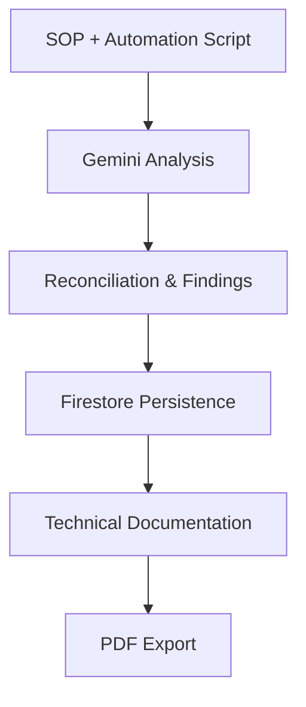
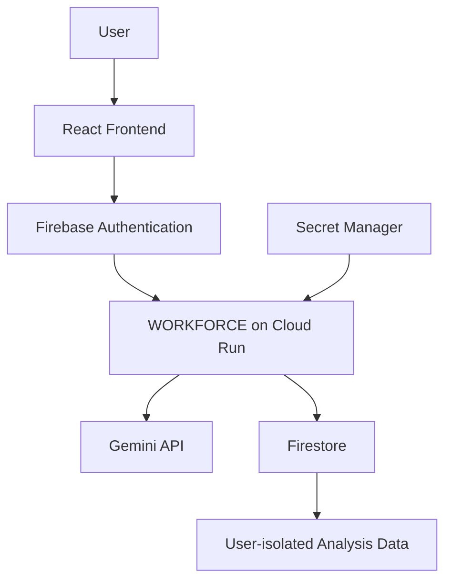
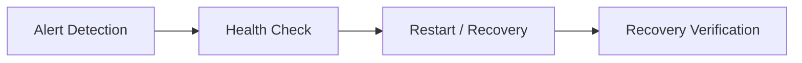

# WORKFORCE

> **Understand the SOP. Find the automation gaps. Generate the documentation.**

WORKFORCE is an authenticated, Gemini-powered application that reconciles the operational intent documented in Standard Operating Procedures (SOPs) with the actual behavior of automation scripts. It identifies implementation gaps, preserves structured analysis, and turns the findings into reusable technical documentation.

Built for the **Google Cloud Run AI Challenge**.

## Why WORKFORCE?

Automation changes quickly. Documentation often does not.

Scripts are patched, workflows evolve, and production behavior changes while SOPs and technical documents may continue to describe an older process. This creates an important operational question:

> **Does the automation running today still represent what the documentation says it should do?**

WORKFORCE helps answer that question by creating a reconciliation layer between **operational intent** and **automation reality**.

## Core Workflow



### 1. Understand and Reconcile

Users provide an operational SOP and its corresponding automation script or lifecycle. Gemini analyzes both sources to identify:

- intended operational workflow
- actual automation behavior
- commands and actions
- normal and abnormal conditions
- dependencies and scheduling context
- technical and operational impact
- discrepancies between documentation and implementation

The result is a structured comparison of **what should happen according to the SOP** and **what the automation actually does**.

### 2. Preserve and Revisit

Completed analyses are stored in Firestore rather than disappearing after a single AI response. Authenticated users can return to the dashboard, review previous analyses, and reopen saved work.

Each record is scoped to the authenticated Firebase user, turning Gemini output into a persistent working artifact.

### 3. Generate Documentation

WORKFORCE transforms validated findings into structured technical documentation that can include:

- automation context and purpose
- workflow and technical behavior
- reconciliation findings and gaps
- operational considerations
- reusable documentation sections

The generated document can then be exported as a PDF.

## Key Features

| Capability | Description |
| --- | --- |
| SOP understanding | Extracts the intended operational process and requirements. |
| Script analysis | Interprets the implemented automation behavior. |
| Reconciliation | Compares documented intent with actual implementation. |
| Gap identification | Highlights missing, different, or potentially outdated behavior. |
| Persistent analysis | Stores results in Firestore for later review. |
| Multi-turn interaction | Retains conversational context across follow-up requests. |
| Documentation generation | Converts structured findings into reusable technical documentation. |
| PDF export | Produces a portable document for review and distribution. |

## Architecture



## Multi-Turn Gemini Interaction

In addition to the main reconciliation workflow, WORKFORCE provides an authenticated multi-turn Gemini experience. A user can establish context and continue with follow-up requests without repeating the full subject.

```text
User: I'm preparing technical documentation for a service restart
      automation used when a service experiences an issue.

User: Without repeating everything, summarize the purpose of the
      automation I mentioned earlier in two sentences.
```

Gemini retains the relevant context from the earlier turn and uses it to answer the follow-up request.

## Security by Design

Operational documents and automation artifacts may contain sensitive information, so WORKFORCE applies security controls across identity, data, and credential boundaries.

| Control | Implementation |
| --- | --- |
| Authentication | Firebase Authentication establishes user identity. |
| User isolation | Firestore Security Rules restrict records using the authenticated Firebase UID. |
| Credential management | The Gemini API key is stored in Google Cloud Secret Manager. |
| Server-side secret access | Cloud Run retrieves the Gemini credential through a secret reference. |
| Prompt-injection awareness | Security-focused AI Studio instructions treat uploaded content as untrusted input. |
| Cross-user leakage prevention | Database-level ownership rules prevent access to another user's analyses. |
| Repository hygiene | Secrets and local `.env` files are excluded from the public repository. |

### Firestore Ownership Boundary

Analysis documents include the authenticated Firebase UID. Firestore Security Rules enforce ownership at the database layer rather than relying only on frontend filtering.

```javascript
match /analyses/{analysisId} {
  allow create: if request.auth != null
    && request.resource.data.userId == request.auth.uid;

  allow read: if request.auth != null
    && resource.data.userId == request.auth.uid;
}
```

### Secret Management

The production Gemini credential is injected into Cloud Run from Google Cloud Secret Manager instead of being stored in client-side code or committed configuration.

```yaml
GEMINI_API_KEY:
  valueFrom:
    secretKeyRef:
      key: latest
      name: gemini-api-key
```

Google AI Studio was also used during development to define security-focused guidance covering threat modeling, secure coding, prompt injection, data leakage, privilege escalation, and secret handling.

## Demo Assets

The repository includes sanitized artifacts so the workflow can be reviewed without exposing confidential operational information. All identifiers, infrastructure values, addresses, names, paths, and operational references in these files are synthetic or sanitized.

### Sample SOP

- [Sanitized Service Restart SOP](./public/demo-assets/restart_service_sop_sanitized%20%281%29.pdf)

### Sample Automation Scripts

- [Alert Detection Script](./public/demo-assets/alert_check_link.sh)
- [Health Check Script](./public/demo-assets/health_check_link.sh)
- [Restart and Recovery Script](./public/demo-assets/restart_link.sh)

Together, the scripts represent this simplified lifecycle:



## Technology Stack

| Area | Technology |
| --- | --- |
| AI development | Google AI Studio |
| Generative AI | Gemini API |
| Frontend | React |
| Authentication | Firebase Authentication |
| Database | Firestore |
| Secret management | Google Cloud Secret Manager |
| Production runtime | Google Cloud Run |
| Documentation output | PDF generation |

## Run Locally

### Prerequisites

- Node.js and npm
- Firebase project configuration
- Gemini API credentials for local development

### 1. Clone the repository

```bash
git clone https://github.com/rahmadikaaa/workforce_C3.git
cd workforce_C3
```

### 2. Install dependencies

```bash
npm install
```

### 3. Configure the environment

Copy the example configuration and add the required local Firebase and Gemini development values.

```bash
cp .env.example .env
```

> Local development may use environment variables. The production Cloud Run deployment retrieves the Gemini API credential from Google Cloud Secret Manager.

Never commit `.env` files containing credentials.

### 4. Start the development server

```bash
npm run dev
```

### 5. Create a production build

```bash
npm run build
```

## Deployment

The production application is deployed on Google Cloud Run with the challenge label:

```text
dev-tutorial=cloud-run-ai-challenge
```

- **Live application:** [Launch WORKFORCE](https://reflect-ai-candidate-620658281668.europe-west1.run.app)
- **Source code:** [github.com/rahmadikaaa/workforce_C3](https://github.com/rahmadikaaa/workforce_C3)

## Challenge Highlights

| Criterion | WORKFORCE Approach |
| --- | --- |
| Authenticity | Applies Gemini to a custom SOP-to-automation reconciliation use case rather than simple response generation. |
| Usability | Connects input, analysis, findings, persistence, retrieval, documentation, and export in one workflow. |
| Stability | Provides an authenticated end-to-end application on Cloud Run with persistent Firestore storage. |
| Security | Establishes explicit boundaries for user identity, stored analyses, and application credentials. |

## The Bigger Idea

Automation will continue to evolve faster than static documentation. WORKFORCE explores how Gemini can become a reconciliation layer between **operational intent** and **automation reality**—helping teams understand what is running, identify what changed, preserve the findings, and turn those findings back into useful technical documentation.

> **Understand the SOP. Find the automation gaps. Generate the documentation.**

---

Built with **Google AI Studio · Gemini API · Firebase Authentication · Firestore · Google Cloud Secret Manager · Google Cloud Run**

**#AccelerateAIwithCloudRun**
